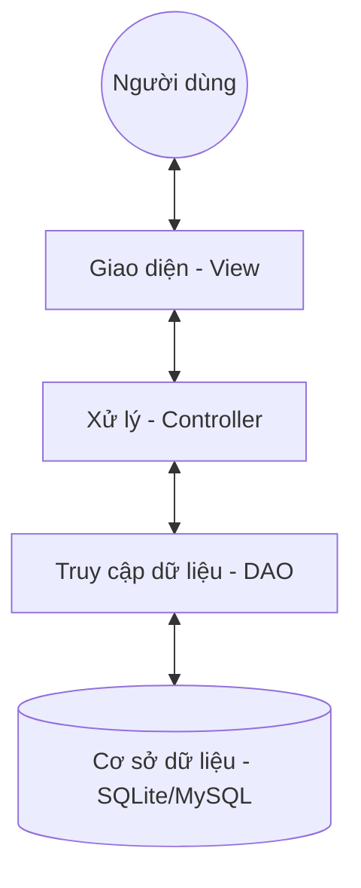
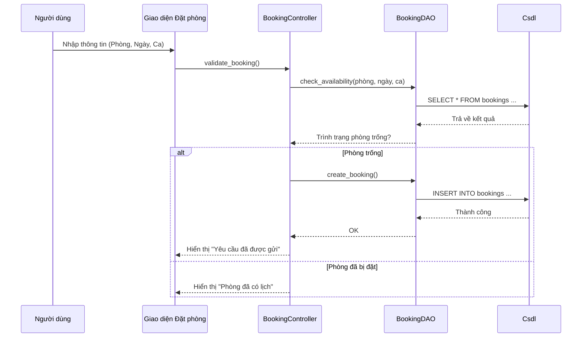

# 📐 Phân tích và Thiết kế Hệ thống (System Analysis & Design)

Hệ thống Quản lý Đặt Phòng Học – Nhóm 24

## 1. Phân tích Kiến trúc (Architecture Analysis)

Hệ thống được thiết kế theo mô hình **MVC (Model-View-Controller)** nhằm đảm bảo tính module hóa và dễ dàng bảo trì.

### 1.1. Sơ đồ Kiến trúc Tổng quát


- **View**: Tiếp nhận sự kiện từ người dùng (nhấn nút, nhập văn bản) và hiển thị kết quả.
- **Controller**: Nhận yêu cầu từ View, thực hiện kiểm tra logic (Validation) và gọi model/DAO.
- **DAO**: Lớp duy duy nhất giao tiếp trực tiếp với Database, che giấu sự phức tạp của các câu lệnh SQL.

## 2. Thiết kế Cơ sở Dữ liệu (Database Design)

### 2.1. Sơ đồ Quan hệ thực thể (ERD)
```mermaid
erDiagram
    USERS ||--o{ BOOKINGS : "thực hiện"
    ROOMS ||--o{ BOOKINGS : "được đặt"
    ROOMS ||--o{ EQUIPMENT : "chứa"

    USERS {
        string id PK
        string username UC
        string full_name
        string role
        string email
        string phone
        string password_hash
        string status
    }

    ROOMS {
        string id PK
        string name UC
        int capacity
        string room_type
        string equipment
        string status
    }

    BOOKINGS {
        string id PK
        string user_id FK
        string room_id FK
        string booking_date
        string slot
        string purpose
        string status
    }

    EQUIPMENT {
        string id PK
        string name
        string equipment_type
        string room_id FK
        string status
        string purchase_date
    }
```

## 3. Thiết kế Quy trình nghiệp vụ (Business Workflows)

### 3.1. Quy trình Đặt phòng học


## 4. Thiết kế Giao diện (UI Design)
Hệ thống sử dụng các Layout Grid và Frame của Tkinter để tổ chức giao diện:
- **Sidebar Navigation**: Menu bên trái giúp chuyển đổi giữa các tính năng.
- **Top Bar**: Hiển thị thông báo, vai trò và thông tin người dùng đang đăng nhập.
- **Content Area**: Vùng hiển thị nội dung chính (Table, Form, Dashboard).

---

